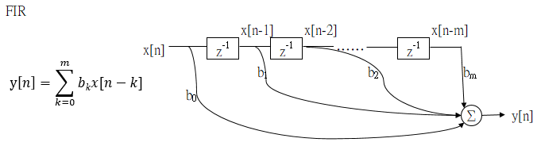

### 1. Reference   
https://en.wikipedia.org/wiki/Finite_impulse_response  
### 2. Finite Impulse Response(FIR)  
The basic filter prototype in signal processing, that can filter high frequency, low frequency or a specified frequency band.
(causal system)  
* FIR Filter (Transition function):  
H(z) = (b0+b1z−1+...+bMz−M) =$$\sum_{k=0}^K b_kz^{-k}$$

* Z Domain :  
$$Y(z) = X(z)\sum_{k=0}^K b_kz^{-k}$$  
* Time Domain :  
$$y(n) = \sum_{k=0}^K b_kx(n-k)$$   

FIR filter only zeros not poles.

### 3.  
Nulling Filter(Notch Filter), BandPass, LowPass, HighPass, BandStop, ByPass.

### 4.  

